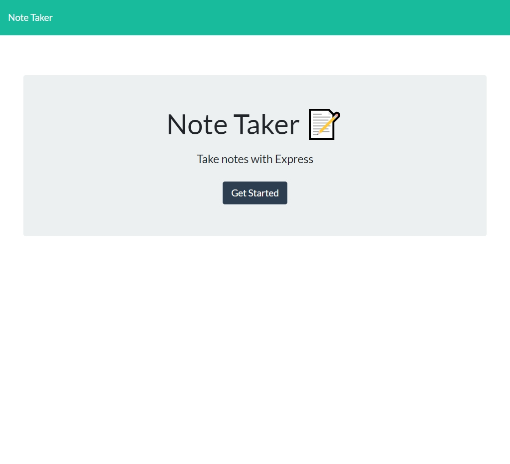

# Notserver
A note-taking app that you can take anywhere without installing a thing!


  
  
  
  

  ## Description

  This application is deployed to Heroku for easy accessibility and use, but if you would like you can also clone this repository and deploy the code yourself to your preferred platform.

  The app includes frontend html and javascript which allow a user to interact with the underlying json file through the DOM. If the user navigates to /api in their browser bar, the application will load the raw json data. This allows you to do whatever you want with your data once it is created.

  Each note is an object with properties of title and text, as well as an id which can all be accessed quite easily.

  The application backend is based on express.js, and utilizes some simple library functions to accomplish creation and deletion of notes.

  

  ## Deployment Link
  [Link to deployed app](https://notserverdh.herokuapp.com/)

  ## Table of contents

  * [Installation](#installation)
  * [Usage](#usage)
  * [Maintainers](#maintainers)
  * [Contributing](#contributing)
  * [Tests](#tests)
  * [Credits](#credits)
  * [License](#license)

  ## Installation
  If you are going to be running the app from your IDE, this step is necessary, otherwise you can use through Heroku without utilizing any CLI commands.

  Make sure you have the latest stable version of node installed: ```node --version```

  Fork the project and clone the repository. Then in your CLI enter ```node install``` which will install express.js, as it is the only dependency.

  ## Usage
  If you are not running the app through Heroku:

  It is important that if you will be making your own changes to your forked code and deploying to Heroku that you have the latest version of git. In your CLI enter ```git --version```. If you have an outdated version use ```git update``` to resolve this before attempting to use the Heroku CLI tool.

  In the CLI enter ```npm start``` to initiate the application. Then navigate to the following url in your preferred browser: [Link to local host](http://localhost:3003/)

  ## Maintainer
  [@Daniel Harned](https://github.com/DrDano)

  Email: [danielharned@gmail.com](mailto:danielharned@gmail.com)

  ## Contributing
  Forking is encouraged if you would like to contribute!

  ## Credits
  
  * [express.js](https://expressjs.com/)

  ## License
  Licensed under [MIT](https://choosealicense.com/licenses/mit) 2022 
  
  